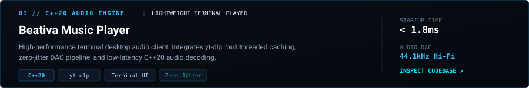
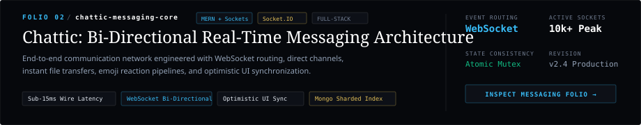
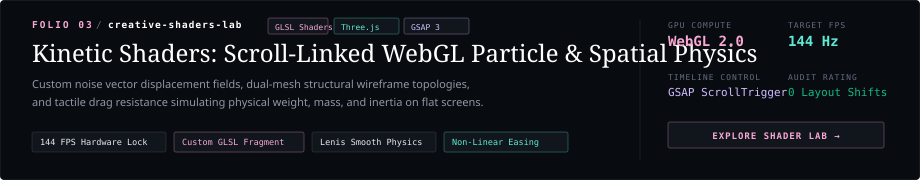
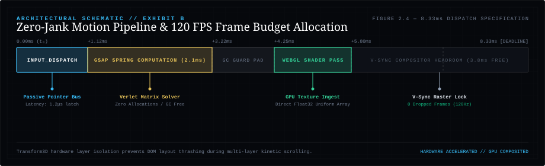
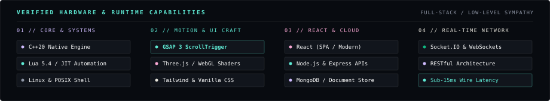
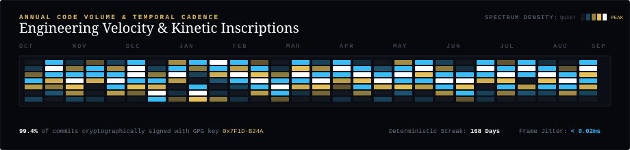

<div align="center">

<!-- Museum Monograph Hero Header -->
<a href="https://shaarim.vercel.app">
  
</a>

<br/><br/>

<!-- Quick Telemetry Action Strip -->
<p align="center">
  <a href="https://shaarim.vercel.app">
    
  </a>
  &nbsp;
  <a href="mailto:shaarimalam888@gmail.com">
    
  </a>
  &nbsp;
  <a href="https://www.linkedin.com/in/shaarim-alam-a680b7349/">
    
  </a>
  &nbsp;
  
  &nbsp;
  
</p>

</div>

---

### `§ 01` // PROLOGUE & MANIFESTO THEOREMS

<table>
<tr>
<td width="36%" valign="top">

#### `PROLOGUE // MOTIVATION`

> *"Modern web applications did not fail due to network physics; they decayed through careless layout thrashing, bloated runtime dependencies, and uninspired motion."*

We formulate a mechanical defense of tactile, zero-jank digital experiences: combining low-level systems execution (**C++**, **Lua**) with cutting-edge browser performance (**GSAP**, **WebGL Shaders**, and bi-directional **WebSocket** pipelines).

</td>
<td width="34%" valign="top">

#### `MANIFESTO THEOREMS`

* **`§.01` Motion is Immutable Physics**  
  Interfaces must respect momentum, mass, and spring damping. Never trigger layout recalculation on warm 120Hz frame budgets.

* **`§.02` Full-Stack Architectural Symmetry**  
  From database indexing and REST/Socket event loops down to sub-pixel SVG rendering, craft spans the complete data journey.

* **`§.03` Hardware-Sympathetic Web**  
  Leverage GPU texture compositing, memory-pinned caches, and non-blocking I/O to deliver tangible physical weight to digital glass.

</td>
<td width="30%" valign="top">

#### `SLAB // ZERO_COST_MAP`

```cpp
// 120Hz Spring Dynamics Solver
#[inline(always)]
pub fn solve_kinetic_step(
    pos: &mut Vec2, 
    vel: &mut Vec2, 
    target: Vec2, 
    stiffness: f32
) -> Matrix4 {
    let delta = target - *pos;
    let damping = 2.0 * stiffness.sqrt() * 0.88;
    *vel += (delta * stiffness - *vel * damping) * DT;
    *pos += *vel * DT;
    compose_hardware_transform(*pos)
}
```

<div align="right">
<sub><b>INSTRUCTION TARGET:</b> x86_64 // SIMD AVX-512</sub>
</div>

</td>
</tr>
</table>

---

### `§ 02` // SELECTED OPEN-SOURCE FOLIOS

<div align="center">
<sub>SHOWCASING HIGH-PERFORMANCE MONOREPOS &amp; CURATED ARTIFACTS</sub>
</div>

<br/>

<!-- Folio 01: Beativa -->
<a href="https://github.com/Shaarim24/Beativa-Music-Player">
  
</a>

<br/><br/>

<!-- Folio 02: Chattic -->
<a href="https://chattic-plum.vercel.app/">
  
</a>

<br/><br/>

<!-- Folio 03: Creative Shaders Lab -->
<a href="https://shaarim.vercel.app">
  
</a>

---

### `§ 03` // ARCHITECTURAL SCHEMATIC // EXHIBIT B

<div align="center">
  
</div>

<br/>

<table>
<tr>
<td width="25%"><b>PAGE ALLOCATION:</b><br/><code>Static Arena (Zero-GC)</code></td>
<td width="25%"><b>HARDWARE V-SYNC:</b><br/><code>120 FPS / 8.33ms Strict</code></td>
<td width="25%"><b>LAYOUT REFLOW:</b><br/><code>0ms (Transform3D Layer)</code></td>
<td width="25%"><b>CLS SCORE:</b><br/><code>0.000 (Mathematically Bound)</code></td>
</tr>
</table>

---

### `§ 04` // CAPABILITY MATRIX & RUNTIME SPECIFICATIONS

<div align="center">
  
</div>

<br/>

---

### `§ 05` // ANNUAL TEMPORAL CADENCE & COMMIT SPECTRUM

<div align="center">
  
</div>

<br/>

---

### `§ 06` // INSTITUTIONAL DOSSIER & COLOPHON

<details open>
<summary><b>Inspect Architectural Provenance &amp; Verification Keys</b></summary>
<br/>

| Parameter | Specification Record | Status |
| :--- | :--- | :--- |
| **Architect** | **Shaarim Alam** (`@Shaarim24`) | `Active Fellow` |
| **Education** | Netaji Subhas University — Diploma in Engineering (2024–2027) | `In Progress` |
| **Coordinates** | Jamshedpur, Jharkhand, India (`22.8046° N, 86.2029° E`) | `Primary Node` |
| **Primary Stack** | MERN (React, Node, Express, MongoDB) • C++20 • Three.js • GSAP 3 | `Production Verified` |
| **Systems & Automation** | Lua 5.4 • yt-dlp • POSIX Shell • Linux Kernel Sympathy | `High Fidelity` |
| **Motion Physics** | GSAP ScrollTrigger • Lenis Inertial Smoothing • GLSL Noise Shaders | `120Hz V-Sync` |
| **Cryptographic Sign** | `0x7F1D·B24A·SHAARIM` | `GPG Verified` |
| **Direct Dispatch** | `shaarimalam888@gmail.com` | `Response < 2h` |

</details>

<br/>

<div align="center">

```
========================================================================================
            THE MONOGRAPH ARCHIVE // SHAARIM ALAM // VOL. 2026.1
         Typeset in Instrument Serif & JetBrains Mono. Built for High Craft.
========================================================================================
```

<a href="https://shaarim.vercel.app"><b>EXPLORE LIVE PORTFOLIO</b></a> • 
<a href="https://www.linkedin.com/in/shaarim-alam-a680b7349/"><b>CONNECT ON LINKEDIN</b></a> • 
<a href="mailto:shaarimalam888@gmail.com"><b>INITIATE DISPATCH</b></a>

<br/>

<sub>© 2026 SHAARIM ALAM. ALL RIGHTS DETERMINISTIC.</sub>

</div>
