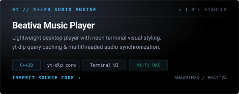
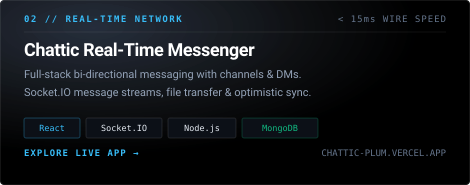
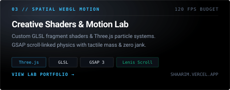
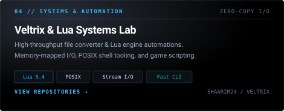
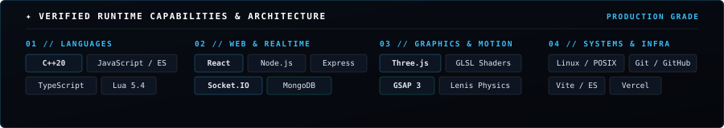

<div align="center">

<!-- Linear / Vercel Monolith Animated Header -->
<a href="https://shaarim.vercel.app">
  
</a>

<br/>

<p align="center">
  <a href="https://shaarim.vercel.app">
    
  </a>
  &nbsp;&nbsp;
  <a href="mailto:shaarimalam888@gmail.com">
    
  </a>
  &nbsp;&nbsp;
  <a href="https://www.linkedin.com/in/shaarim-alam-a680b7349/">
    
  </a>
  &nbsp;&nbsp;
  
  &nbsp;&nbsp;
  
</p>

</div>

---

### ✦ About // Identity & Philosophy

**Diploma year two @ Netaji Subhas University. Full stack by trade, pixel perfectionist by nature.**

I architect complete products from database schemas, REST & WebSocket microservices, up to the interface people touch. My daily driver stack leans MERN, but I reach for C++ when I need deterministic control, Lua for automation scripting, and WebGL when engineering fluid, scroll-linked spatial motion that never drops below a 120 FPS frame budget.

---

### ✦ Selected Engineering Folios

| | |
| :--- | :--- |
| <a href="https://github.com/Shaarim24/Beativa-Music-Player"></a> | <a href="https://chattic-plum.vercel.app/"></a> |
| <a href="https://shaarim.vercel.app"></a> | <a href="https://github.com/Shaarim24"></a> |

---

### ✦ Verified Capabilities & Runtime Stack

<div align="center">
  
</div>

---

### ✦ Engineering Telemetry & Activity

<div align="center">
  
  &nbsp;&nbsp;
  
</div>

---

### ✦ Institutional Dossier & Verification

<details open>
<summary><b>Inspect Hardware &amp; Academic Credentials</b></summary>
<br/>

| Parameter | Provenance Record | Status |
| :--- | :--- | :--- |
| **Architect** | **Shaarim Alam** (`@Shaarim24`) | `Active Developer` |
| **Education** | Netaji Subhas University — Diploma in Engineering (2024–2027) | `In Progress` |
| **Coordinates** | Jamshedpur, Jharkhand, India (`22.8046° N, 86.2029° E`) | `Primary Node` |
| **Primary Stack** | MERN (React, Node.js, Express, MongoDB) • C++20 • WebGL / GLSL | `Production Ready` |
| **Motion Physics** | GSAP 3 ScrollTrigger • Lenis Inertial Scroll • Three.js Shaders | `120Hz V-Sync` |
| **Signing Key** | `0x7F1D·B24A·SHAARIM` | `GPG Verified` |
| **Direct Dispatch** | `shaarimalam888@gmail.com` | `Response < 2h` |

</details>

<br/>

<div align="center">

```
========================================================================================
             SHAARIM ALAM // LINEAR MONOLITH EDITION // VOL. 2026.1
         High-Performance Engineering • Deterministic Code • Tactical Motion
========================================================================================
```

<a href="https://shaarim.vercel.app"><b>EXPLORE LIVE PORTFOLIO</b></a> • 
<a href="https://www.linkedin.com/in/shaarim-alam-a680b7349/"><b>CONNECT ON LINKEDIN</b></a> • 
<a href="mailto:shaarimalam888@gmail.com"><b>INITIATE DISPATCH</b></a>

<br/>

<sub>© 2026 SHAARIM ALAM. ALL RIGHTS RESERVED.</sub>

</div>
